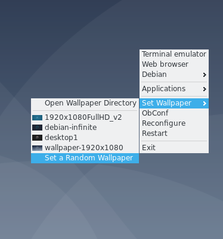

# bmenu
This is a fork and port of http://openbox.org/wiki/Openbox:Pipemenus:bmenu-1.0 to Python 3.x, and with some additional features.
<p align="center">
   
</p>

Copied from the main.py file (with some modifications):


This file (main.py) inserts a wallpaper pipe menu into Openbox which uses feh
in order to set the wallpaper from a chosen directory.
                                                                              
Authors: dav1d(main author) and Pwnz3r(hacker and redistributor)
                                                                              
Dav1d's site: http://southwing.homeip.net/~david/
Pwnz3r's site: http://pstudios.ath.cx/
 
feh automatically inserts the full command string used to set the wallpaper
into ~/.fehbg. In order to set the wallpaper back at the next start of 
Openbox, just add the following to ~/.xinitrc: ``` eval `cat ~/.fehbg` ```

Added Features:
- Ported to Python 3.x
- Thumbnails, so you don't go guessing in the dark
- An extra file, which is used to generate thumbnails

## Requirements
- Python 3.x
- Make
- git
- feh


Get all the required packages command for Debian based systems with this nifty command:
```
sudo apt install build-essential git feh
```


Clone the repository with 
```
git clone TODO: add the repository link, after creating it
```

## Installation
Use ```make install``` with proper permissions.
Removal with ```make uninstall```, again with proper permissions.


## Running
Make sure that you have ```showIcons``` set to yes in your ```rc.xml```. Sea http://openbox.org/wiki/Help:Menus.
See http://openbox.org/wiki/Help:Menus#Pipe_menus for how to set up ```bmenu``` in your menu.xml.


Here's how I have in my menu.xml [snippet]:


```	
	<menu id="bmenu" label="Set Wallpaper">
		execute="bmenu /home/ruusaig/Pictures/Wallpapers /home/ruusaig/Pictures/.thumbnails/"/>
```


The dmenu command I use in my menu.xml:


```
bmenu /path/to/wallpapers/ /path/to/thumbnails/
```


Command used to generate the thumbnails, for bmenu:


```
genthumbs /path/to/wallpapers/ /path/to/destination/of/thumbnails/
```


## Contributing
Critiques, pull requests, all that good stuff are very welcome! Please be nice, and also give me some pointers, 
I'm still learning this programming thing, you see.

## Links, References and other Cool Stuff
Wallpaper sources:


https://wiki.debian.org/DebianArt/Themes/solidBlue


https://wiki.debian.org/DebianArt/Themes/Infinite


https://wiki.debian.org/DebianArt/Themes/futurePrototype

Code for genthumbs.py:
https://stackoverflow.com/questions/8631076/what-is-the-fastest-way-to-generate-image-thumbnails-in-python

http://openbox.org/wiki/Openbox:Pipemenus

The original bmenu, written for Python 2.x:
http://openbox.org/wiki/Openbox:Pipemenus:bmenu-1.0
